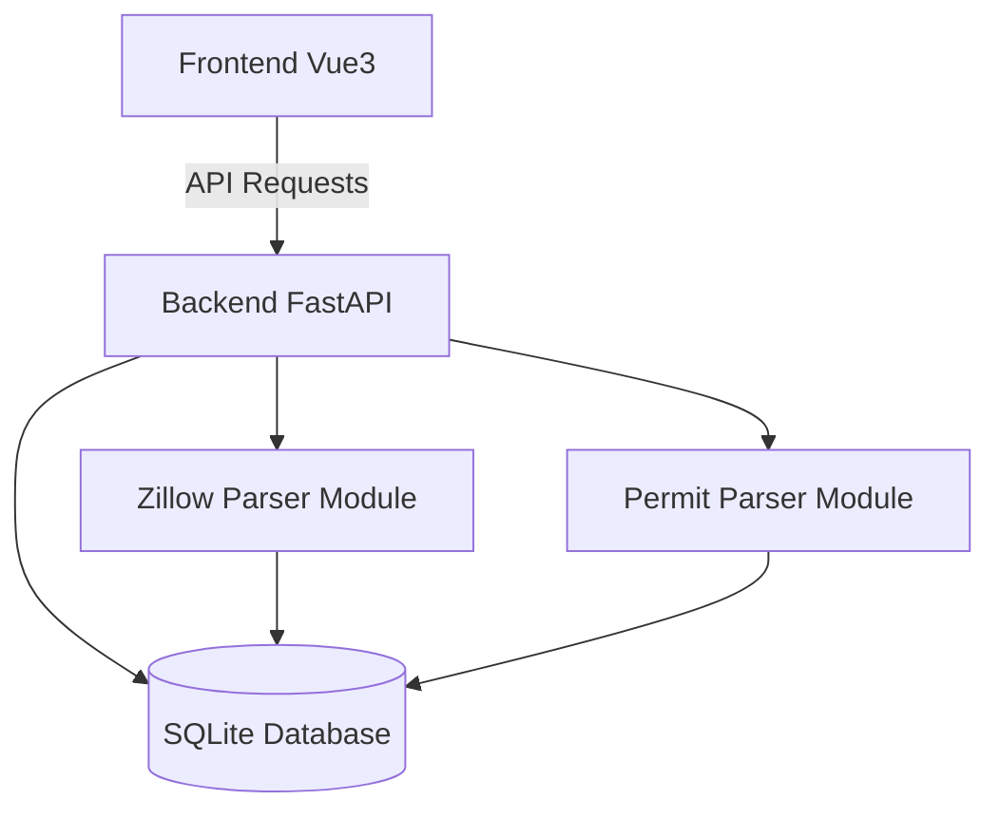

# План: Единая CRM-система для парсеров

## Обзор архитектуры

Создаем профессиональную CRM-систему, которая объединит два парсера (Zillow и Seattle Permits) в единый интерфейс с общей базой данных и аналитикой.



## 1. Структура проекта

Новая структура корня проекта:

```
renova-parse-app/
├── frontend/                    # ← Вынесенный из zillow-parsing
│   ├── src/
│   │   ├── components/
│   │   ├── views/
│   │   │   ├── Dashboard.vue    # NEW: Главная страница
│   │   │   ├── ZillowParse.vue  # Парсинг Zillow
│   │   │   ├── PermitParse.vue  # NEW: Парсинг пермитов
│   │   │   ├── Analytics.vue    # NEW: Аналитика
│   │   │   └── AllData.vue      # Все данные
│   │   ├── layouts/
│   │   │   └── MainLayout.vue   # NEW: Sidebar навигация
│   │   ├── router/
│   │   ├── api.js
│   │   └── main.js
│   ├── package.json
│   └── vite.config.js
├── backend/                     # Единый backend
│   ├── main.py                  # Главный FastAPI app
│   ├── database.py              # Единая БД (SQLite)
│   ├── models.py                # Pydantic модели
│   ├── routers/
│   │   ├── zillow.py            # Zillow endpoints
│   │   ├── permits.py           # NEW: Permits endpoints
│   │   └── analytics.py         # NEW: Analytics endpoints
│   ├── services/
│   │   ├── zillow_parser.py     # Zillow parsing logic
│   │   └── permit_parser.py     # NEW: Permit parsing logic
│   └── requirements.txt
├── parsers/
│   ├── zillow-parsing/          # Zillow парсер (backend удален)
│   │   └── src/core/
│   └── permit-parsing/          # Permit парсер
│       └── src/
└── start.py                     # Единый запуск
```

## 2. База данных (SQLite)

### Схема БД

**Таблица: `zillow_jobs`** (парсинг задачи Zillow)

- id, urls, status, current_url_index, total_urls, homes_found, unique_homes
- error_message, started_at, completed_at

**Таблица: `zillow_homes`** (дома Zillow)

- id, job_id, zpid, address, city, state, zipcode
- price, beds, baths, area_sqft, raw_data, created_at

**Таблица: `permit_jobs`** (парсинг задачи пермитов)

- id, status, year, permit_class_filter, min_cost
- permits_found, owner_builders_found, started_at, completed_at

**Таблица: `permits`** (пермиты)

- id, job_id, permit_num, permit_class, permit_type, description
- est_project_cost, applied_date, address, city, state, zipcode
- contractor_name, is_owner_builder, verification_status
- latitude, longitude, created_at

Файл: [`backend/database.py`](backend/database.py)

## 3. Backend API

### Основной файл: [`backend/main.py`](backend/main.py)

Объединяет все роутеры:

```python
app = FastAPI(title="Renova Parse CRM")
app.include_router(zillow_router, prefix="/api/zillow", tags=["Zillow"])
app.include_router(permits_router, prefix="/api/permits", tags=["Permits"])
app.include_router(analytics_router, prefix="/api/analytics", tags=["Analytics"])
```

### Роутеры

**1. Zillow Router** ([`backend/routers/zillow.py`](backend/routers/zillow.py))

- POST `/api/zillow/parse` - запуск парсинга
- GET `/api/zillow/status/{job_id}` - статус
- GET `/api/zillow/jobs` - список задач
- GET `/api/zillow/homes` - дома с фильтрами
- GET `/api/zillow/export/{job_id}` - экспорт CSV

**2. Permits Router** ([`backend/routers/permits.py`](backend/routers/permits.py))

- POST `/api/permits/parse` - запуск парсинга пермитов
- GET `/api/permits/status/{job_id}` - статус
- GET `/api/permits/jobs` - список задач
- GET `/api/permits/list` - список пермитов с фильтрами
- GET `/api/permits/export/{job_id}` - экспорт CSV/Excel

**3. Analytics Router** ([`backend/routers/analytics.py`](backend/routers/analytics.py))

- GET `/api/analytics/overview` - общая статистика
- GET `/api/analytics/zillow/price-distribution` - распределение цен
- GET `/api/analytics/zillow/timeline` - динамика по времени
- GET `/api/analytics/zillow/by-city` - группировка по городам
- GET `/api/analytics/permits/cost-distribution` - распределение стоимости
- GET `/api/analytics/permits/timeline` - динамика пермитов
- GET `/api/analytics/permits/map-data` - данные для карты

### Сервисы

**Zillow Parser Service** ([`backend/services/zillow_parser.py`](backend/services/zillow_parser.py))

- Использует существующий код из `zillow-parsing/src/core/`
- Адаптирует под новую структуру БД

**Permit Parser Service** ([`backend/services/permit_parser.py`](backend/services/permit_parser.py))

- Интегрирует код из `permit-parsing/src/`
- API client, browser scraper, data processor
- Сохранение в единую БД

## 4. Frontend

### Навигация (Sidebar)

**MainLayout.vue** - основной layout с sidebar:

```
┌─────────────────────────────────────────┐
│ ☰ Renova Parse CRM     │  Main Content │
│                         │               │
│ 📊 Dashboard            │   [Router     │
│ 🏠 Zillow Parsing       │    View]      │
│ 📋 Permits Parsing      │               │
│ 📈 Analytics            │               │
│ 💾 All Data             │               │
└─────────────────────────────────────────┘
```

### Страницы

**1. Dashboard** ([`frontend/src/views/Dashboard.vue`](frontend/src/views/Dashboard.vue))

Главная страница с обзором:

- Карточки статистики: Всего домов (Zillow), Всего пермитов, Owner-builders, Последний парсинг
- Последние добавленные записи (таблица)
- Быстрые действия (кнопки запуска парсингов)

**2. Zillow Parsing** ([`frontend/src/views/ZillowParse.vue`](frontend/src/views/ZillowParse.vue))

Переименованная/перенесенная `ParseView.vue`:

- Форма ввода URL
- Статус парсинга в реальном времени
- История парсингов
- Таблица результатов

**3. Permits Parsing** ([`frontend/src/views/PermitParse.vue`](frontend/src/views/PermitParse.vue))

Новая страница для парсинга пермитов:

- Форма конфигурации: год, класс пермита, минимальная стоимость
- Кнопка запуска парсинга
- Статус: прогресс, найдено пермитов, верифицировано owner-builders
- История парсингов пермитов
- Таблица результатов (пермиты + verification status)

**4. Analytics** ([`frontend/src/views/Analytics.vue`](frontend/src/views/Analytics.vue))

Страница аналитики со всеми типами визуализации:

### Графики (Chart.js)

- **Line Chart**: Динамика домов/пермитов по времени
- **Bar Chart**: Распределение по городам/районам
- **Histogram**: Распределение цен/стоимости проектов
- **Pie Chart**: Доля owner-builders vs contractors

### Карты (Leaflet.js)

- Интерактивная карта с маркерами
- Кластеризация объектов
- Popups с информацией (адрес, цена, тип)
- Фильтры по типу (Zillow homes / Permits)

### Статистика (KPI карточки)

- Общая стоимость проектов
- Средняя цена дома
- Топ-5 городов по количеству
- Рост за период (%)

**5. All Data** ([`frontend/src/views/AllData.vue`](frontend/src/views/AllData.vue))

Расширенная версия `AllDataView.vue`:

- Переключение между Zillow и Permits
- Единые фильтры
- Таблица с сортировкой
- Экспорт в CSV/Excel
- Пагинация

### Компоненты

**Общие компоненты:**

- `Sidebar.vue` - боковая навигация
- `StatCard.vue` - карточка статистики
- `DataTable.vue` - универсальная таблица
- `ChartCard.vue` - обертка для графиков
- `MapView.vue` - компонент карты
- `StatusBadge.vue` - бейдж статуса
- `ExportButton.vue` - кнопка экспорта

**Zillow компоненты** (существующие):

- `UrlInput.vue`
- `ParseStatus.vue`
- `ParseHistory.vue`

**Permit компоненты** (новые):

- `PermitConfigForm.vue` - форма настроек парсинга
- `PermitParseStatus.vue` - статус парсинга
- `PermitTable.vue` - таблица пермитов

## 5. Библиотеки и зависимости

### Backend

**requirements.txt:**

```
fastapi>=0.104.0
uvicorn[standard]>=0.24.0
pydantic>=2.0.0
playwright>=1.41.0
playwright-stealth>=1.0.6
httpx>=0.27.0
pandas>=2.2.0
openpyxl>=3.1.0
loguru>=0.7.0
python-dotenv>=1.0.0
```

### Frontend

**Новые зависимости (добавить в package.json):**

```json
{
  "chart.js": "^4.4.0",
  "vue-chartjs": "^5.3.0",
  "leaflet": "^1.9.4",
  "vue-leaflet": "^0.1.0"
}
```

## 6. Дизайн (Светлый профессиональный)

### Цветовая палитра

```css
/* Primary */
--primary-50: #eff6ff;
--primary-500: #3b82f6;
--primary-600: #2563eb;
--primary-700: #1d4ed8;

/* Neutral (Gray) */
--gray-50: #f9fafb;
--gray-100: #f3f4f6;
--gray-200: #e5e7eb;
--gray-500: #6b7280;
--gray-700: #374151;
--gray-900: #111827;

/* Success */
--green-500: #10b981;
--green-100: #d1fae5;

/* Warning */
--yellow-500: #f59e0b;
--yellow-100: #fef3c7;

/* Error */
--red-500: #ef4444;
--red-100: #fee2e2;
```

### UI элементы

- **Sidebar**: Белый фон, синяя иконка активного пункта
- **Header**: Светло-серый фон (gray-50)
- **Cards**: Белый фон, тонкая тень, скругленные углы (8px)
- **Tables**: Белый фон, чередующиеся строки (hover: gray-50)
- **Buttons**: Primary (blue-600), Secondary (gray-100), Success (green-500)
- **Inputs**: Белый фон, серая рамка, фокус - синяя рамка

## 7. Интеграция парсеров

### Zillow Parser

Существующий код из `zillow-parsing/src/core/` интегрируется в `backend/services/zillow_parser.py`:

```python
from parsers.zillow_parsing.src.core.playwright_search import search_from_url_playwright_sync
```

### Permit Parser

Код из `permit-parsing/src/` интегрируется в `backend/services/permit_parser.py`:

```python
from parsers.permit_parsing.src.api_client import SeattlePermitsAPI
from parsers.permit_parsing.src.browser_scraper import verify_owner_builder
```

Основные модули:

- `api_client.py` - получение данных из Seattle Open Data API
- `browser_scraper.py` - верификация через Playwright
- `data_processor.py` - обработка и очистка данных

## 8. Миграция данных

Если в `zillow-parsing/backend/data/zillow.db` уже есть данные:

1. Создать скрипт миграции `backend/migrate_data.py`
2. Скопировать данные из старой БД в новую
3. Сохранить старую БД как backup

## 9. Запуск системы

**Единый скрипт запуска:** [`start.py`](start.py)

```python
# Проверка зависимостей
# Запуск backend (uvicorn)
# Запуск frontend (npm run dev)
```

Команда:

```bash
python start.py
```

Доступ:

- Frontend: http://localhost:5173
- Backend API: http://localhost:8000
- API Docs: http://localhost:8000/docs

## 10. Порядок реализации

1. **Инфраструктура**

   - Создать структуру директорий
   - Настроить единую БД
   - Создать базовый FastAPI app

2. **Backend API**

   - Реализовать роутеры (zillow, permits, analytics)
   - Интегрировать сервисы парсинга
   - Добавить endpoints

3. **Frontend Layout**

   - Создать MainLayout с Sidebar
   - Настроить роутинг
   - Перенести существующие компоненты

4. **Dashboard**

   - Общая статистика
   - Последние записи
   - Быстрые действия

5. **Zillow Pages**

   - Адаптировать существующие страницы
   - Интеграция с новым API

6. **Permits Pages**

   - Форма конфигурации
   - Статус парсинга
   - Таблица результатов

7. **Analytics**

   - Интеграция Chart.js
   - Интеграция Leaflet карт
   - KPI карточки

8. **Тестирование**

   - Проверка парсингов
   - Проверка аналитики
   - Экспорт данных